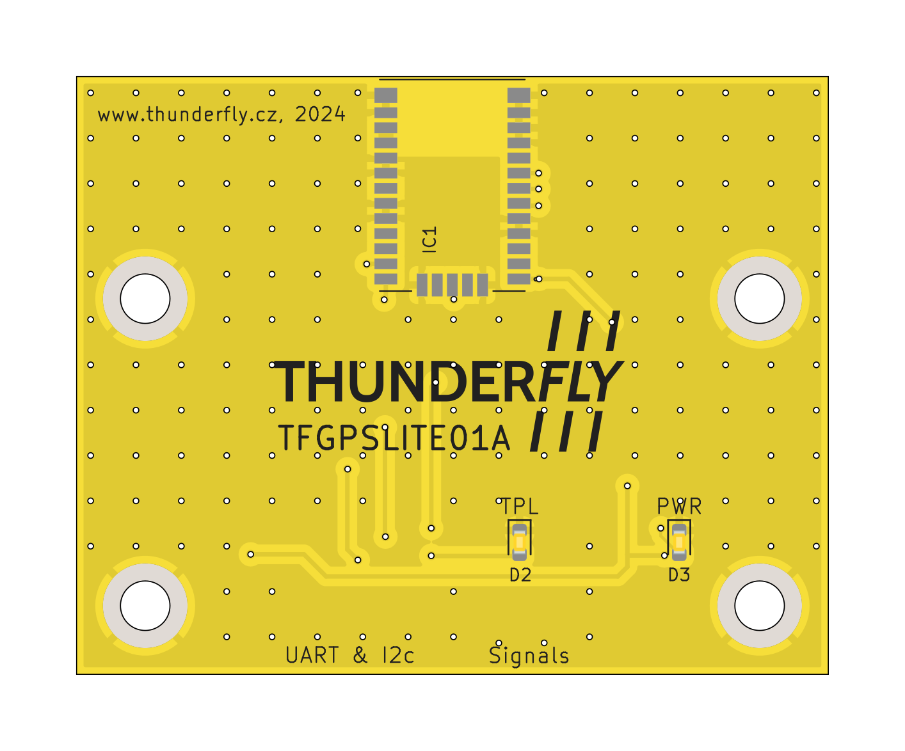
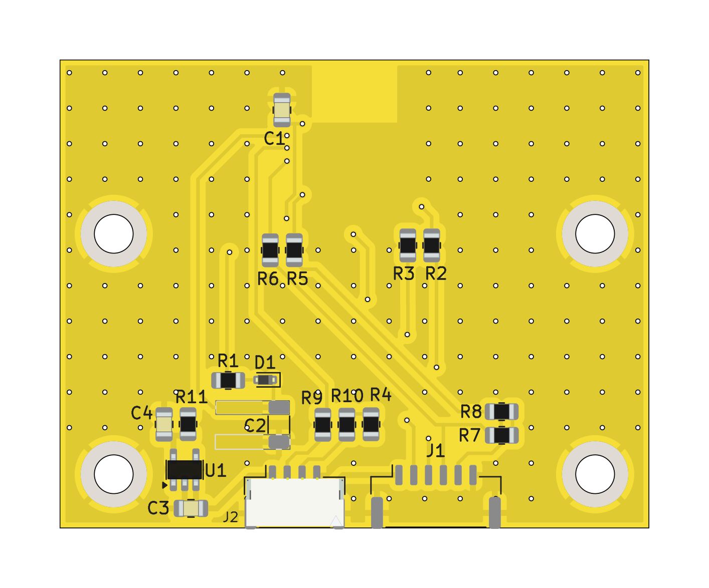

# TFGPSLITE01 - Basic GNSS Module for Small UAV Applications

The **TFGPSLITE01** module is a GNSS (Global Navigation Satellite System) module based on the [u-blox CAM-M8 series GNSS receiver](https://www.u-blox.com/en/product/cam-m8-series). 
This module is primarily designed for use in small, simple unmanned aerial vehicles (UAVs), where basic GPS functionality is required. It utilizes the "Basic GPS Port" as defined in the [Pixhawk connector standard (DS-009)](https://github.com/pixhawk/Pixhawk-Standards/blob/master/DS-009%20Pixhawk%20Connector%20Standard.pdf).

Despite being functional, **TFGPSLITE01** exhibited several performance limitations during testing:
- Time-to-first-fix (TTFF) under favorable conditions was in the range of several minutes, which is not suitable for applications requiring fast initialization.
- The module struggled to maintain a stable fix, further reducing its reliability.

Due to these shortcomings, the module has been superseded by [**TFGPSLITE02**](https://github.com/ThunderFly-aerospace/TFGPSLITE02), which utilizes a different GNSS receiver to address these issues and achieve significantly better performance.

---

## Technical Details
### Features
- **GNSS Constellations**: Supports GPS and GLONASS constellations by default.
- **Interfaces**:
  - UART: 9600 baud rate (default), 8 data bits, no parity bit, 1 stop bit.
  - I2C compliant DDC (slave mode).
- **Power Requirements**:
  - Input Voltage: 5.4 V.
  - Backup Voltage: 1.4–3.6 V.
- **Antenna Options**: Integrated GNSS antenna (the ability of module to use an external antenna is not applied).
- **Connector**: JST GH series connector, compatible with the Pixhawk "Basic GPS Port".

### Performance Specifications
- **Receiver Type**: 72-channel concurrent GNSS receiver.
- **Sensitivity**:
  - Cold start: -148 dBm.
  - Tracking: -167 dBm.
- **Accuracy**: 
  - Horizontal Position: 2.5 meters (CEP, 50% under ideal conditions).
- **Time-to-First-Fix (TTFF)**:
  - Cold Start: ~26–30 seconds (theoretical).
  - Aided Start: ~2–3 seconds (theoretical).
  - **Real-world Performance**: Multiple minutes for cold start, even under good conditions.

## Connector Pinout

The TFGPSLITE01 uses the Pixhawk "Basic GPS Port" pinout as described in the DS-009 standard:
| Pin | Signal        | Voltage |
|-----|---------------|---------|
| 1   | VCC           | +5 V    |
| 2   | TX (OUT)      | +3.3 V  |
| 3   | RX (IN)       | +3.3 V  |
| 4   | I2C1 SCL      | +3.3 V  |
| 5   | I2C1 SDA      | +3.3 V  |
| 6   | GND           | GND     |

